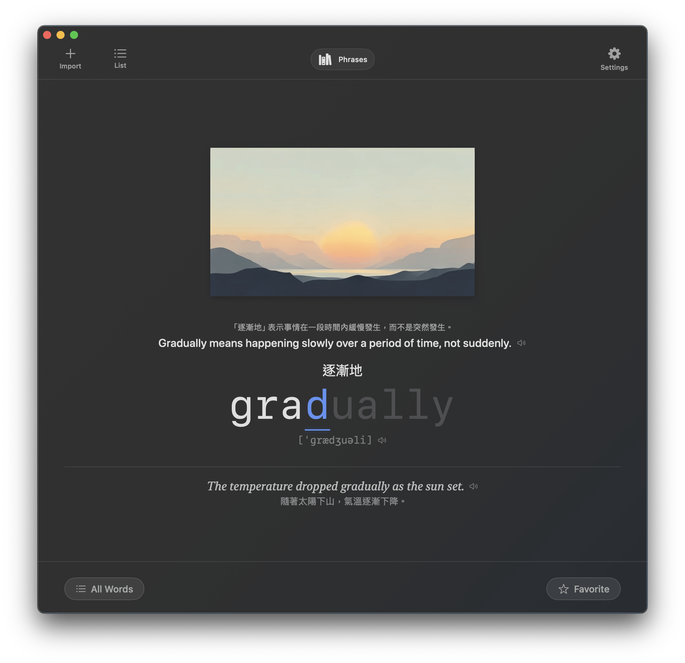

# TypeLex - Minimalist macOS Typing Practice App

TypeLex 是一款專為 macOS 設計的英文單字打字練習 App。它結合原生低延遲打字體驗、TTS 發音、AI 輔助內容生成，以及以複習排程為核心的單字庫管理流程。



## ✨ 主要功能

*   **極致效能打字體驗**：
    *   **低延遲輸入**：利用 Apple **Observation 框架**實現精確重繪，確保打字時僅更新必要字元，即使在複雜背景下也能保持 120 FPS 的流暢響應。
    *   **無干擾設計**：支援 macOS 14+ `onKeyPress`，摒棄傳統輸入框，提供純粹的鍵盤互動。
    *   **可調整發音回饋**：支援字詞重播次數、重播間隔、自動播放例句與翻譯顯示偏好。
    *   **即時視覺回饋**：輸入正確顯示高亮，錯誤時以柔和紅底提示，並搭配動畫效果。
    *   **艾賓浩斯複習排程**：單字會依答題結果進入遺忘曲線複習間隔，已到期單字優先出現。
*   **AI 驅動與智慧內容**：
    *   **深度釋義**：整合 **Gemini 2.5 Flash Lite**，自動生成精確的英文釋義、IPA 音標與情境例句。支援 **Pollinations AI** 無縫備援，即使沒有 API Key 也能正常運作。
    *   **雙語對照**：特別優化的中文翻譯格式（如：「制止」某人...），幫助快速理解詞性與用法。
    *   **意境圖生成**：預設使用 **Pollinations AI** 生成莫蘭迪色系 (Morandi) 插圖，並支援 **Stability AI (SDXL)** 作為高品質備援，確保生成穩定性。
    *   **智慧偵錯與重試**：支援 Gemini -> Pollinations、Pollinations -> Stability 的備援策略。

*   **現代化學習介面**：
    *   **首次啟動引導**：內建 onboarding，支援首次載入內建詞庫、匯入自訂詞庫、跳過 API key 設定。
    *   **完整狀態設計**：空書庫、匯入失敗、快捷鍵說明、設定/儲存位置錯誤都提供明確的 inline 或全畫面狀態。
    *   **高效能架構**：採用 Swift Concurrency (`.task`) 進行圖片異步加載與資源管理，滑動切換單字流暢無卡頓。
    *   **視覺層次化**：清晰區分視覺錨點（圖片）、互動區（打字）與資訊區（例句、翻譯）。
    *   **桌面 App 操作性**：支援 menu commands、快捷鍵說明 overlay、工具列入口。

*   **單詞本管理**：
    *   **資料夾組織化**：每個單詞本擁有獨立資料夾，將 CSV 資料與 `media` (圖片、聲音) 分開存放，確保資源不混亂。
    *   **多模式練習**：支援「全部單字」、「我的最愛」與「錯誤加強」三種循環模式。
    *   **單字清單管理**：支援搜尋、排序、多選、批次 favorite / delete / reset progress / move to book。
    *   **統計與日曆**：提供每日完成數、正確率、streak、7 日趨勢與複習日曆檢視。
    *   **靈活匯入**：支援標準 CSV 格式、`4000 Essential English Words` 結構匯入，並**支援 .zip 壓縮檔直接匯入**，系統會自動解壓並整理資料。
    *   **離線優先**：圖片與發音優先讀取單詞本資料夾內的 `media` 目錄，無網路也能順暢練習。

*   **隱私與安全**：
    *   **Keychain 整合**：API Key 安全加密儲存。
    *   **Sandbox 支援**：透過 Security-Scoped Bookmarks 安全存取使用者授權的單字庫目錄。

## 📂 資料夾結構 (Storage Structure)

App 採用資料夾為單位的管理模式，結構如下：
```text
Documents/
├── BookName_A/
│   ├── BookName_A.csv     # 單字列表資料
│   └── media/             # 該單詞本專屬媒體資源
│       ├── apple.png
│       └── apple.mp3
└── BookName_B/
    ├── BookName_B.csv
    └── media/
```
啟動時會自動遷移舊版扁平結構檔案至此資料夾結構。

## 🛠 技術架構

*   **平台**：macOS 14.0+
*   **語言**：Swift 5.10+
*   **UI 框架**：SwiftUI (Modern Declarative Architecture)
    *   **併發安全與主執行緒狀態**：`PracticeViewModel`、`SpeechService`、`AppRouter`、`AppSettingsStore` 以 `@MainActor`/Observation 管理 UI 狀態與互動流程。
    *   **@Observable 驅動**：全面採用 macOS 14 導入的 Observation 框架，精確追蹤屬性依賴，實現微秒級的視圖局部更新。
    *   **TypingEngine 狀態機**：純 Swift 邏輯層，完全分離 UI 狀態與打字演算法，易於測試與維護。
    *   **模組化拆分**：資料層已拆成 storage / migration / stats / operations / recovery；UI 層已拆出 shared view support、word list support、practice effect support。
    *   **路由與設定集中管理**：以 `AppRouter` 統一 sheet/overlay 狀態，以 `AppSettingsStore` 集中偏好設定，不再散落 `NotificationCenter` 與 `@AppStorage`。
    *   **Service Boundary**：`OpenPanel`、speech、文字生成、圖片生成、telemetry/crash reporting 都透過 protocol 注入，降低 ViewModel 與系統 API / provider 的耦合。
*   **AI 模型**：
    *   **Text**: Gemini 2.5 Flash Lite + Pollinations AI (Keyless Fallback)
    *   **Image**: Pollinations AI + Stability AI SDXL (High-quality Fallback)
*   **資料儲存**：高效能 CSV + review-events JSON，支援多單詞本切換與 Security-Scoped 儲存權限。
*   **診斷能力**：內建 `OSLog` category-based logging，並預留 telemetry / crash reporting boundary，方便之後接 Sentry 或 Crashlytics。

## 🧱 專案結構

```text
TypeLex/
├── Data/
│   ├── WordRepository.swift
│   ├── WordRepositoryStorage.swift
│   ├── WordRepositoryMigration.swift
│   ├── WordRepositoryStats.swift
│   ├── WordRepositoryOperations.swift
│   ├── WordRepositoryRecovery.swift
│   ├── WordEntry.swift
│   ├── ReviewEvent.swift
│   ├── PracticePreferences.swift
│   └── AppSettingsStore.swift
├── Services/
│   ├── AppPanelService.swift
│   ├── AppServices.swift
│   ├── GeminiService.swift
│   ├── ImageService.swift
│   └── SpeechService.swift
├── UI/
│   ├── PracticeView.swift
│   ├── PracticeViewModel.swift
│   ├── PracticeViewModelSupport.swift
│   ├── PracticeViewModelEffects.swift
│   ├── WordListView.swift
│   ├── WordListSupport.swift
│   ├── WordListRowViews.swift
│   └── ViewSupport.swift
├── AppRouter.swift
└── Utilities/
    ├── AppLogger.swift
    └── AppStrings.swift
```

## 🚀 如何開始

1.  **設定 API Key (選填)**：
    *   點擊右上角 **⚙️ (Settings)**，輸入 Google Gemini 或 Stability AI 密鑰。
    *   **註**：若不填入密鑰，系統會自動使用免費的 **Pollinations AI** 進行文字與圖片生成；清空後按 `Save` 即可移除已儲存的 key。

2.  **載入單字庫**：
    *   初次使用可點擊 **Load @4000 Essential Words** 載入專案內建範例。
    *   或選擇 **Import Custom Library** 匯入您的學習資料夾。

3.  **操作指南**：
    *   **打字**：直接鍵盤輸入英文單字。
    *   **導航**：`←` 上一個單字，`→` 跳過單字。
    *   **快捷鍵**：`⌘I` 開啟匯入、`⌘L` 開啟單字清單、`⌘,` 開啟設定、`⌘/` 顯示快捷鍵說明。
    *   **發音**：點擊單字、釋義或例句可聆聽發音。
    *   **預覽**：點擊圖片可查看大圖。
    *   **管理**：點擊右下角 ⭐ 加入收藏，左下角切換練習模式。

## 🧪 測試

目前已建立 `TypeLexTests` target，包含：

*   `TypingEngineTests`
*   `CSVHelperTests`
*   `WordRepositoryTests`

已覆蓋的重點包含：

*   CSV 讀寫與舊資料 migration
*   forgetting-curve review scheduling
*   transaction-like rollback / persistence failure recovery
*   `mergeUserProgress`
*   `importLibrary` merge/path rewrite
*   `changeStorageLocation`
